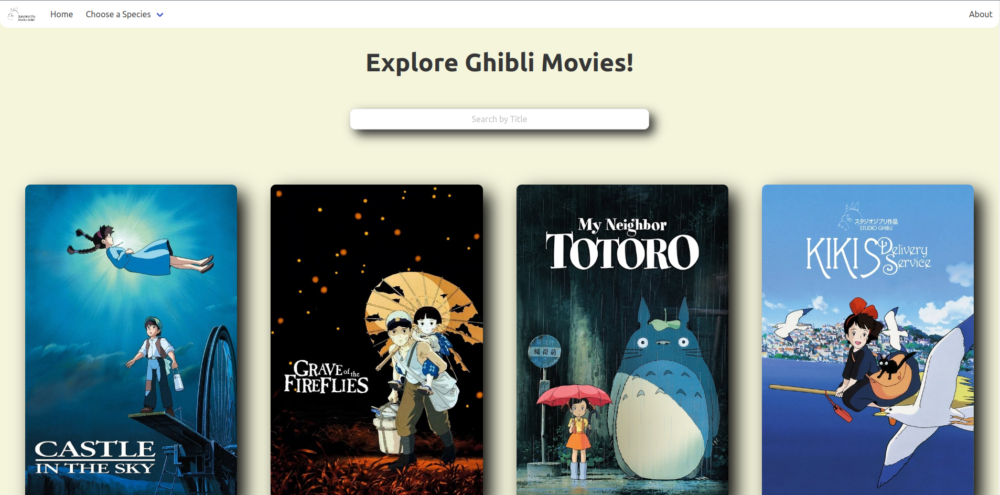

# Ghibli Explorer

Ghibli Explorer is a website that can help you explore the different Ghibli Movies, it's characters and species. It works by consuming the amazing [Studio Ghibli API](https://ghibliapi.herokuapp.com/#section/Studio-Ghibli-API).

## Screenshots

### Mobile


### Desktop



I built this website purely to help me learn how to develop websites using React.
The site is deployed on Vercel and you can check it out here: https://ghibli-explorer.vercel.app/

# Tools I Used

-   [React](https://www.reactjs.org)
-   [React Router](https://v5.reactrouter.com/)
-   [LESS](https://lesscss.org/)
-   [Bulma](https://bulma.io/)
-   [Bulma Components](https://github.com/couds/react-bulma-components)

# Some of the things I learned

## React

If you have a big OCD, don't use functional components. Turns out that to imitate the function `componentDidMount` from class components, we have to do something like this:

```javascript
useEffect(() => {
	// Do something here.
}, []);
```

This will run when the component mounts, and also when the states inside the array changes. If we don't pass any dependency it won't run again, thus imitating the behaviour of `componentDidMount`. However, React acts as if this were a mistake and will complain with a warning. Nothing breaks, but the warning will stay there.

## CSS Preprocessors

I really like the idea behind preprocessors, I'm not a fan of CSS so the less of it I write, the better. For this I had two choices, LESS or SASS, both seemed similar to me so I went with LESS because I liked the syntax a little more.

Once I started to look for ways to integrate .less files and possible Bulma Extensions (more on that later), I realized SASS support out-of-the-box is better, so I will be trying that on my next websites.

## CSS Frameworks

Like I said I'm not a fan of CSS, but I also didn't want my site to look like crap, so using a css framework was always on my mind. I had a few options:

-   **Bootstrap:** ~~It feels a bit outdated~~ Actually, I took a look at the recently released v5 after finishing this website and it looks GOOOOOD. Will definitely check it out in the future.
-   **Tailwind CSS:** I've wanted to use this since the first time I heard about it, but the learning curve seemed a bit much considering I wanted something simple that looks good enough.

I finally went with **Bulma**, which seemed like the perfect choice. It looks modern, and it's very simple to get started. It's user base is not as big as the previous ones, but for a simple site like this I didn't mind.

All in all I liked it a lot and I'm sure I'll be using it again, however I think in the future I'll try a few more just for the fun of it.

## CSS Frameworks as React Components

I came across this cool project called [React Bulma Components](https://github.com/couds/react-bulma-components), and it's exactly that. React components to use Bulma without the bother of writing a lot of html and class names. I liked it, **a lot**. However it was a very bad idea to use it while learning the basics.

The thing is, it creates such and abstraction from the html and classes that I end up not just loosing control but also not understanding what's going on, what classes are or are not being implemented.

For example, this should have been enough to align the Home item to the left of the navbar, but it didn't work, the items were still showing on the center.

```jsx
<BNavbar.Container align="left">
	<BNavbar.Item href="/">Home</BNavbar.Item>
</BNavbar.Container>
```

Reading the Bulma documentation it seems like the class name for such an item should be `navbar-start`, after looking into the html from the Chrome Dev Tools I realized the Bulma Components didn't add such a class. Once I added the class manually, the navbar worked as expected.

```jsx
<BNavbar.Container className="navbar-start">
	<BNavbar.Item href="/">Home</BNavbar.Item>
</BNavbar.Container>
```

Was I in the wrong or was the Bulma Components?...

Probably me lol, but in the end the real problem is I don't understand these CSS Frameworks that well, nor how they should behave and look. Until I do, I better held myseld from using these components again.
